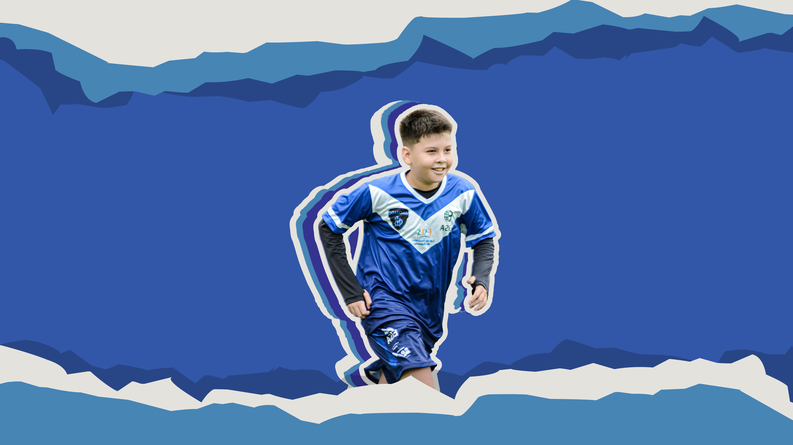
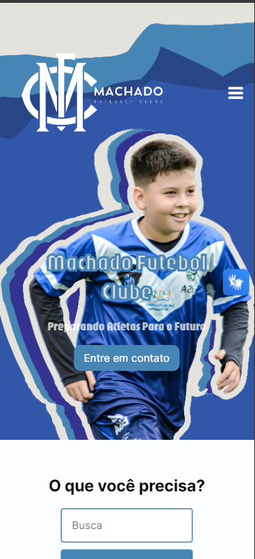

# Machado Futebol Clube - Website


## Sobre o Projeto

O site do Machado Futebol Clube foi desenvolvido com o objetivo de criar uma experiência moderna e inovadora, totalmente diferente dos tradicionais sites institucionais. O design foi cuidadosamente elaborado para ser visualmente atraente e funcional, proporcionando uma navegação intuitiva e envolvente para os usuários.




## Tecnologias Utilizadas

- **HTML5**: Utilizado para a estruturação das páginas.
- **CSS3**: Utilizado para a estilização, incluindo técnicas avançadas de layout e design responsivo.
- **JavaScript**: Utilizado para adicionar interatividade e dinamismo ao site.

## Funcionalidades

- **Design Moderno**: Interface visualmente atraente e fora do convencional.
- **Responsividade**: Layout adaptável para diversos dispositivos (desktop, tablet e mobile).
- **Interatividade**: Elementos interativos que melhoram a experiência do usuário.

## Estrutura do Projeto
|-- index.html
|-- css/
| |-- styles.css
|-- js/
| |-- scripts.js
|-- images/
| |-- logo.png
| |-- home-page.png
| |-- [outras imagens...]
|-- README.md
## FInal - Estrutura do Projeto

## Como Executar o Projeto

1. Clone este repositório:
    ```bash
    git clone https://github.com/seu-usuario/colegio-alianca.git
    ```

2. Navegue até o diretório do projeto:
    ```bash
    cd colegio-alianca
    ```

3. Abra o arquivo `index.html` no seu navegador preferido.

## Contribuições

Contribuições são bem-vindas! Se você tiver sugestões ou encontrar problemas, por favor, abra uma [issue](https://github.com/seu-usuario/colegio-alianca/issues) ou envie um pull request.

## Licença

Este projeto está licenciado sob a Licença MIT. Veja o arquivo [LICENSE](LICENSE) para mais detalhes.

## Agradecimentos

Gostaríamos de agradecer ao Colégio Aliança pela oportunidade de desenvolver este projeto.


---

Feito com ❤️ por [Samuel Junqueira](https://github.com/samueljunq)
